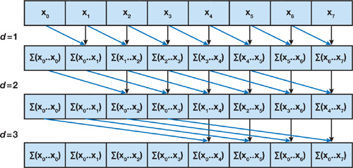
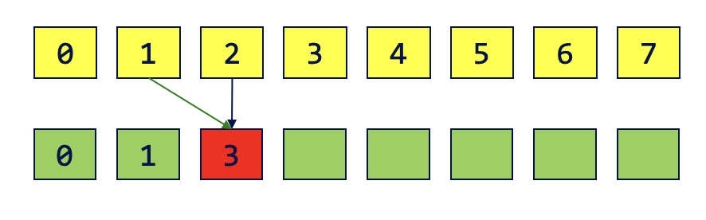
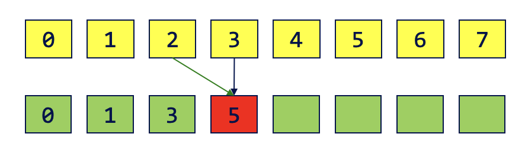

CUDA Stream Compaction
======================

**University of Pennsylvania, CIS 565: GPU Programming and Architecture, Project 2**

### A Naive Paralle Scan




 * d = 1 → addition operation from 1 to n
 * d = 2 → addition operation from 2 to n
 * d = 3 → addition operation from 4 to n
 * ...
 * d = $log_2n$ → addition operation from ${2^{d-1}}$ to n

#### Algorithm:
---
*for d = 1 to $log_2n$\
&nbsp;&nbsp;&nbsp;&nbsp; for k = 0 to n \
&nbsp;&nbsp;&nbsp;&nbsp;&nbsp;&nbsp;&nbsp;&nbsp; if (k>=${2^{d-1}}$) output[k] += input[k - ${2^{d-1}}$] \
&nbsp;&nbsp;&nbsp;&nbsp;&nbsp;&nbsp;&nbsp;&nbsp; else output[k] = input[k]*

--- 

It should be noted that with this algorithm in-place change could cause race condition, as shown below. \
1\
2  Order of 1 and 2 affect the scan result. Thus we need double-buffer to avoid that. 

```
__global__ void scan(float *g_odata, float *g_idata, int n) {
    extern __shared__ float temp[]; // allocated on invocation
    int thid = threadIdx.x;
    int pout = 0, pin = 1;

    // Load input into shared memory.
    // This is exclusive scan, so shift right by one
    // and set first element to 0
    temp[pout * n + thid] = (thid > 0) ? g_idata[thid - 1] : 0;
    __syncthreads();

    for (int offset = 1; offset < n; offset *= 2) {
        pout = 1 - pout; // swap double buffer indices
        pin = 1 - pout;

        if (thid >= offset)
            temp[pout * n + thid] += temp[pin * n + thid - offset];
        else
            temp[pout * n + thid] = temp[pin * n + thid];

        __syncthreads();
    }

    g_odata[thid] = temp[pout * n + thid]; // write output
}

```


